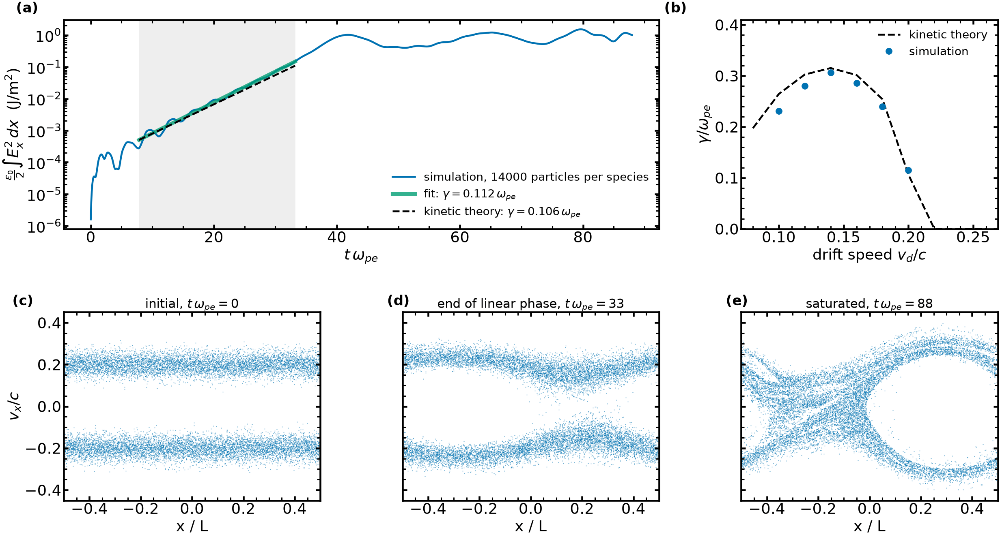
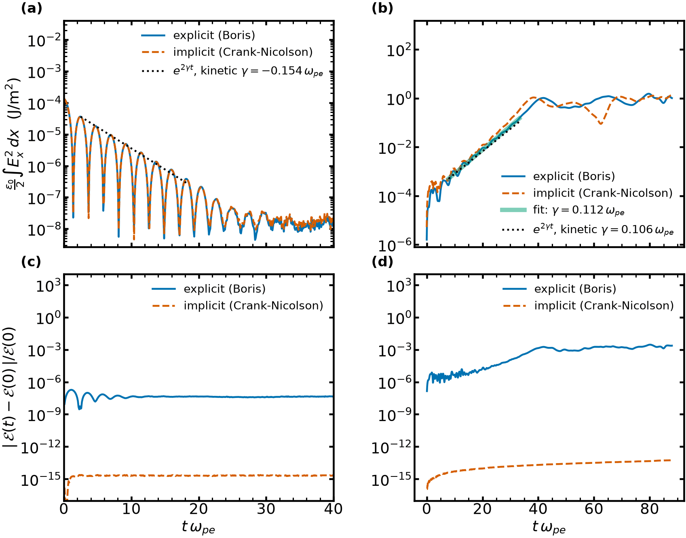
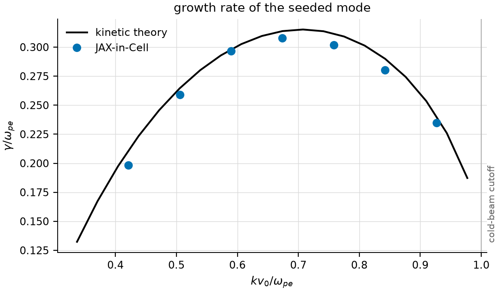
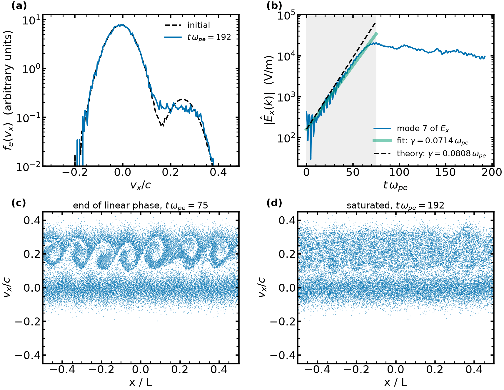
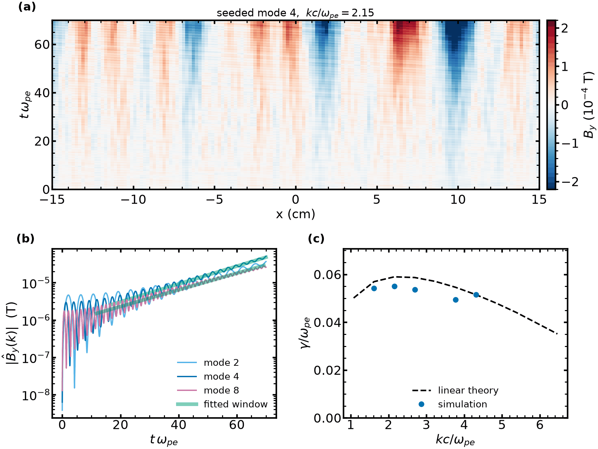

<p align="center">
    
    
</p>

<p align="center">
A one-dimensional, three-velocity electromagnetic particle-in-cell code written in JAX.<br>
Runs on CPU, GPU and TPU, compiles the whole time loop, and is differentiable end to end.
</p>

<p align="center">
    <a href="https://github.com/uwplasma/JAX-in-Cell/actions/workflows/build_test.yml"></a>
    <a href="https://github.com/uwplasma/JAX-in-Cell/actions/workflows/docs.yml"></a>
    <a href="https://jax-in-cell.readthedocs.io/en/latest/"></a>
    <a href="https://codecov.io/gh/uwplasma/JAX-in-Cell"></a>
    <a href="https://pypi.org/project/jaxincell/"></a>
    <a href="LICENSE"></a>
</p>

**Documentation: [jax-in-cell.readthedocs.io](https://jax-in-cell.readthedocs.io/)**

## What it does

JAX-in-Cell advances charged pseudo-particles in one spatial dimension and three
velocity components under the Lorentz force, and advances the electric and magnetic
fields on a staggered (Yee) grid with Maxwell's equations. It provides

* an explicit leapfrog integrator with the Boris pusher (non-relativistic or
  relativistic), a charge-conserving current deposit and a compensated digital filter;
* an implicit Crank-Nicolson integrator solved by Picard iteration, which conserves
  energy to round-off and has no light-wave time-step limit;
* electromagnetic or electrostatic (Gauss's law by FFT) field solvers;
* periodic, reflective and absorbing boundaries, chosen separately for particles and
  fields;
* any number of electron and ion populations, each with its own density, drift,
  temperature anisotropy and seed;
* gradients of any output with respect to the physical inputs through `jax.grad`,
  and re-execution with new inputs without recompilation.

Everything runs as one XLA program on whatever device JAX finds.

## Install

```bash
pip install jaxincell
```

or from source:

```bash
git clone https://github.com/uwplasma/JAX-in-Cell
cd JAX-in-Cell
pip install -e .
```

For a GPU, install the matching JAX wheel first (for example `pip install -U "jax[cuda12]"`).
The package enables 64-bit floating point in JAX when imported.

## Run

From the command line, with the built-in defaults or a TOML file:

```bash
jaxincell
jaxincell examples/input.toml
```

From Python:

```python
from jaxincell import Simulation, load_parameters, diagnostics, plot

parameters = load_parameters("examples/input.toml")   # or a nested dictionary
sim = Simulation(parameters)
output = sim.run()          # compiled on the first call
diagnostics(output)         # energies, species split, dominant frequency
plot(output)                # animated fields, distributions and phase space
```

The output is a dictionary of arrays: particle positions and velocities, fields,
charge and current densities at every step, plus the derived quantities.

Differentiable inputs can be changed at run time and differentiated:

```python
from jax import grad
import jax.numpy as jnp

def mean_field(drift_speed):
    out = sim.run({"electrons": {"electrons0": {"drift_speed_x": drift_speed}}})
    return jnp.mean(out["electric_field"][:, :, 0])

grad(mean_field)(6e7)
```

## Examples

The `examples/` directory contains scripts for the two-stream instability, Landau
damping, Langmuir waves, the bump-on-tail instability with several populations, the
Weibel instability, a gradient check against finite differences, an optimisation over
an input parameter, an inverse problem solved with forward-mode derivatives, and a
timing study. Each is described in the
[documentation](https://jax-in-cell.readthedocs.io/en/latest/examples/index.html).

<p align="center">
    
</p>

Bump-on-tail instability with periodic (left) and reflective (right) walls:

<table align="center"><tr>
<td><video src="https://github.com/user-attachments/assets/5f085f92-cb65-4765-b586-19e727bd2aab" controls width="100%"></video></td>
<td><video src="https://github.com/user-attachments/assets/9f33bac8-319e-4aba-91fb-befc64bca70e" controls width="100%"></video></td>
</tr></table>

## Benchmarks

Every figure below is drawn by a script in [`docs/scripts/`](docs/scripts) from the code on
`main` (`python docs/scripts/make_all.py`); the numbers are in
[`measurements.json`](docs/_static/figures/measurements.json). Theory is the kinetic
dispersion relation of the same drifting Maxwellians
([`dispersion.py`](docs/scripts/dispersion.py)); the
[verification page](https://jax-in-cell.readthedocs.io/en/latest/numerics/verification.html)
explains how each rate is fitted.

### 1D1V: electrostatic

<p align="center">
    
</p>

<p align="center">
    
</p>

<p align="center">
    
</p>

| case | theory | simulation | script |
|---|---|---|---|
| Landau damping, $k\lambda_D = 0.50$, 300 000 quiet-start electrons | $\gamma = -0.154\,\omega_{pe}$, $\omega_r = 1.417\,\omega_{pe}$ | $\gamma = -0.144$ (explicit and implicit), $\omega_r = 1.404$ | [`fig_landau_damping.py`](docs/scripts/fig_landau_damping.py) |
| Two-stream, `examples/input.toml`, 14 000 particles per species | $\gamma = 0.106\,\omega_{pe}$ | $\gamma = 0.112$; over a scan of 10 drifts, 7 % mean deviation at $N = 32\,000$ | [`fig_two_stream.py`](docs/scripts/fig_two_stream.py), [`fig_two_stream_scan.py`](docs/scripts/fig_two_stream_scan.py) |
| Bump-on-tail, 3 % beam, mode 7 | $\gamma = 0.081$, $\omega_r = 0.990\,\omega_{pe}$ | $\gamma = 0.071$, $\omega_r = 0.986$ | [`fig_bump_on_tail.py`](docs/scripts/fig_bump_on_tail.py) |
| Energy conservation, two-stream above | exact for Crank-Nicolson | relative error $6\times10^{-14}$ (implicit), $3\times10^{-3}$ (explicit) | [`fig_explicit_implicit.py`](docs/scripts/fig_explicit_implicit.py) |

### 1D2V: electromagnetic

<p align="center">
    
</p>

| case | theory | simulation | script |
|---|---|---|---|
| Weibel, $T_z/T_x = 100$, one run per mode | transverse kinetic dispersion relation, $\gamma_{max} = 0.059\,\omega_{pe}$ | 5 of 10 modes fitted, 6 % mean and 9 % largest deviation | [`fig_weibel.py`](docs/scripts/fig_weibel.py) |

The pusher always advances all three velocity components; no 1D3V case on `main` is
yet compared with a reference.

## Documentation

The [documentation](https://jax-in-cell.readthedocs.io/) contains a tutorial, a
user guide with every input parameter and output key, a description of the numerical
methods (grid, shape functions, Boris and Crank-Nicolson schemes, deposition,
filtering, boundaries, stability limits), comparisons with linear theory, the examples,
and the API reference. To build it locally:

```bash
pip install -r docs/requirements.txt
sphinx-build -W -b html docs docs/_build/html
```

## Testing

```bash
pip install pytest pytest-cov
pytest
```

The test suite runs on every pull request for Python 3.9 to 3.12, together with a
build of the documentation.

## Contributing and citing

Bug reports and feature requests go to the
[issue tracker](https://github.com/uwplasma/JAX-in-Cell/issues), questions to the
[discussions](https://github.com/uwplasma/JAX-in-Cell/discussions), and code through
pull requests; see [CONTRIBUTING.md](CONTRIBUTING.md). If you use JAX-in-Cell in
your work, please cite it using the `CITATION.cff` file (GitHub shows it under
"Cite this repository").

## Acknowledgements

JAX-in-Cell was inspired by [PiC-Code-Jax](https://github.com/SeanLim2101/PiC-Code-Jax)
by Sean Lim. Development is supported by the National Science Foundation under grant
PHY-2409066 and by the [UWPlasma](https://rogerio.physics.wisc.edu/) group at the
University of Wisconsin-Madison.

## License

MIT, see [LICENSE](LICENSE).
