<p align="center">
    
    
</p>

<p align="center">
A one-dimensional, three-velocity electromagnetic particle-in-cell code written in JAX.<br>
Runs on CPU, GPU and TPU, compiles the whole time loop, and is differentiable end to end.
</p>

<p align="center">
    <a href="https://github.com/uwplasma/JAX-in-Cell/actions/workflows/build_test.yml"></a>
    <a href="https://github.com/uwplasma/JAX-in-Cell/actions/workflows/docs.yml"></a>
    <a href="https://jax-in-cell.readthedocs.io/en/latest/"></a>
    <a href="https://codecov.io/gh/uwplasma/JAX-in-Cell"></a>
    <a href="https://pypi.org/project/jaxincell/"></a>
    <a href="LICENSE"></a>
</p>

**Documentation: [jax-in-cell.readthedocs.io](https://jax-in-cell.readthedocs.io/)**

## What it does

JAX-in-Cell pushes charged pseudo-particles in one spatial dimension and three velocity
components, and advances the fields on a staggered (Yee) grid. It has

* an explicit leapfrog with the Boris pusher (non-relativistic or relativistic) and a
  charge-conserving deposit, and an implicit Crank-Nicolson scheme that conserves energy and
  charge to round-off with no time-step limit;
* electromagnetic and electrostatic models, a compensated digital filter, and binary Coulomb
  collisions;
* periodic, reflecting, absorbing and partly reflecting walls, particle sources, and floating
  collectors, so a plasma against a wall forms its own sheath;
* external electric and magnetic fields on an $(x, y, z)$ grid;
* gradients of any output with respect to any physical input through `jax.grad`.

The whole run is one XLA program on a CPU, GPU or TPU. Every result below is checked against
a closed-form or linear kinetic result, not against another simulation.

<table align="center">
<tr>
<td></td>
<td></td>
</tr>
<tr>
<td></td>
<td></td>
</tr>
</table>

## Install

```bash
pip install jaxincell
```

or from source:

```bash
git clone https://github.com/uwplasma/JAX-in-Cell
cd JAX-in-Cell
pip install -e .
```

For a GPU, install the matching JAX wheel first (for example `pip install -U "jax[cuda12]"`).

### Precision

Runs are in double precision unless `JAX_ENABLE_X64=0` is set before JAX is imported; every
example sets it at its top. Single precision reproduces the rates and sheaths but not
conservation to round-off. It is not uniformly faster: on a loaded CPU host float32 took 14.7 s
against 24.4 s in float64 (1.7 times faster), while on the GPU tested it was about a hundred
times slower than float64 (not yet profiled); see the device and precision table in
[performance](https://jax-in-cell.readthedocs.io/en/latest/user_guide/performance.html#devices-and-precision).

## Run

From the command line, with a TOML file:

```bash
jaxincell examples/input.toml
```

From Python. Four objects describe a simulation and one method runs it:

```python
from jaxincell import Domain, Simulation, Solver, Species, diagnostics, plot, speed_of_light as c

electrons = Species.electrons(n=10000, density=4.37e17, vth=(0.05 * c, 0, 0),
                              drift=(6e7, 0, 0), plus_minus=True,
                              perturbation_amplitude=5e-7, perturbation_mode=1)
ions = Species.ions(n=10000, density=4.37e17, electrons=electrons)

simulation = Simulation(Domain(length=0.01, cells=64, dt_over_dx_c=4.5),
                        [electrons, ions], Solver(filter_passes=2))

output = simulation.run(1000, seed=0)   # compiled on the first call
diagnostics(output)                     # energies, momentum, Gauss residual, temperatures
plot(output)                            # animated fields, distributions and phase space
```

`Domain`, `Species`, `Solver` and `Simulation` are frozen dataclasses registered as
JAX pytrees. Physical quantities are leaves, so they can be changed without
recompiling and differentiated with respect to; structural settings are static.

```python
import jax, jax.numpy as jnp

gradient = jax.grad(lambda s: jnp.sum(s.run(200, seed=0).E ** 2))(simulation)
print(gradient.species[0].drift, gradient.domain.length)
```

`examples/1_basic/parameters_and_sampling.py` is the tutorial on the inputs and
`examples/2_intermediate/output_and_restart.py` on saving, restarting and openPMD. Every
example leaves a folder with its settings, results and provenance.

## Benchmarks

Each case is checked against a closed-form or linear kinetic result, not against another
simulation. Click a figure for its documentation page; the numbers come from
`docs/_static/figures/measurements.json`, regenerated with the figures by
`python docs/scripts/make_all.py`. The thumbnails are panels of the documentation's figures
(`docs/scripts/readme_figures.py`).

### 1D1V: electrostatic, one velocity component

<table>
<tr>
<td width="50%" valign="top"><a href="https://jax-in-cell.readthedocs.io/en/latest/examples/landau_damping.html">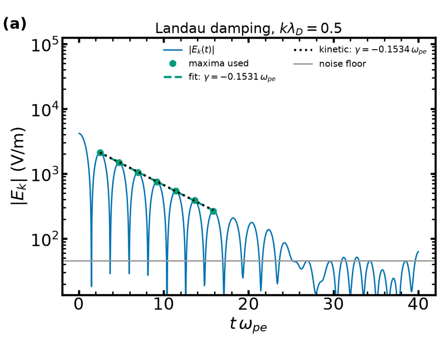</a><br>
<b>Landau damping</b>: rate 0.2 %, frequency 0.3 % from the kinetic root at $k\lambda_D = 0.5$; Langmuir waves to 0.5 % over $k\lambda_D$ 0.05–0.5.<br>
<a href="examples/1_basic/landau_damping.py"><code>1_basic/landau_damping.py</code></a> · <a href="https://jax-in-cell.readthedocs.io/en/latest/examples/landau_damping.html">docs</a></td>
<td width="50%" valign="top"><a href="https://jax-in-cell.readthedocs.io/en/latest/examples/two_stream.html">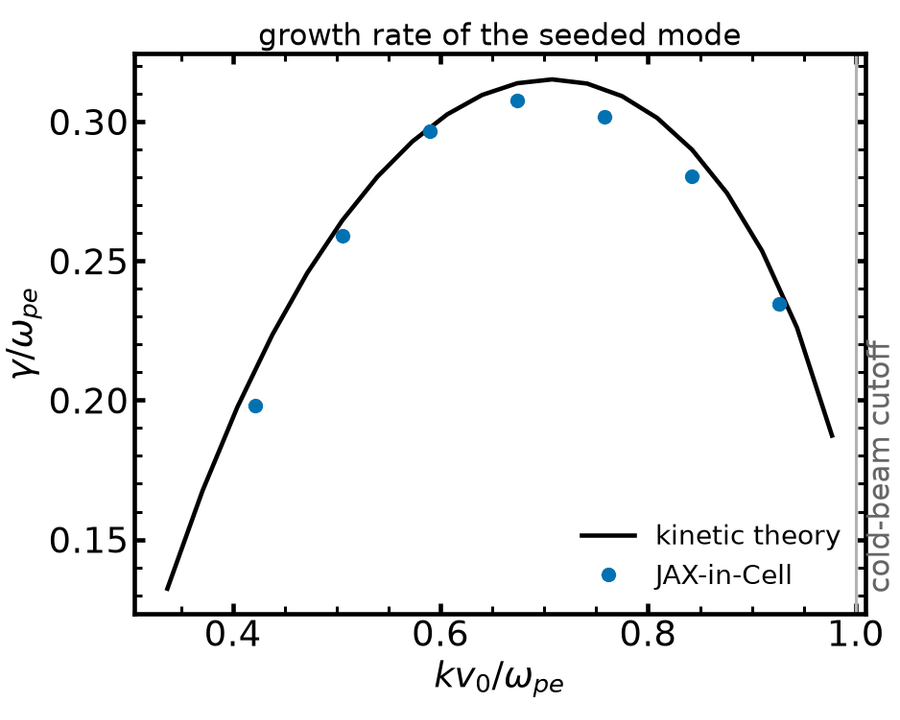</a><br>
<b>Two-stream</b>: growth rate 2.8 % from kinetic theory, mean over the unstable range.<br>
<a href="examples/1_basic/two_stream.py"><code>1_basic/two_stream.py</code></a> · <a href="https://jax-in-cell.readthedocs.io/en/latest/examples/two_stream.html">docs</a></td>
</tr>
<tr>
<td width="50%" valign="top"><a href="https://jax-in-cell.readthedocs.io/en/latest/examples/relativistic_two_stream.html">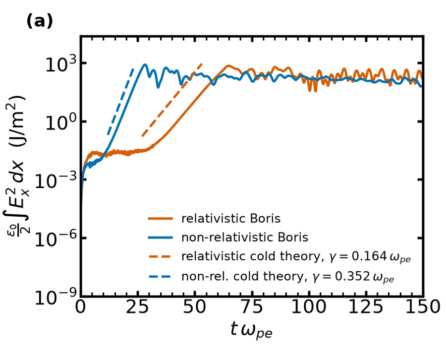</a><br>
<b>Relativistic two-stream</b>: beams at 0.8 c: rate 0.8 % from cold relativistic theory; each Boris pusher conserves its own energy.<br>
<a href="examples/2_intermediate/relativistic_two_stream.py"><code>2_intermediate/relativistic_two_stream.py</code></a> · <a href="https://jax-in-cell.readthedocs.io/en/latest/examples/relativistic_two_stream.html">docs</a></td>
<td width="50%" valign="top"><a href="https://jax-in-cell.readthedocs.io/en/latest/examples/bump_on_tail.html">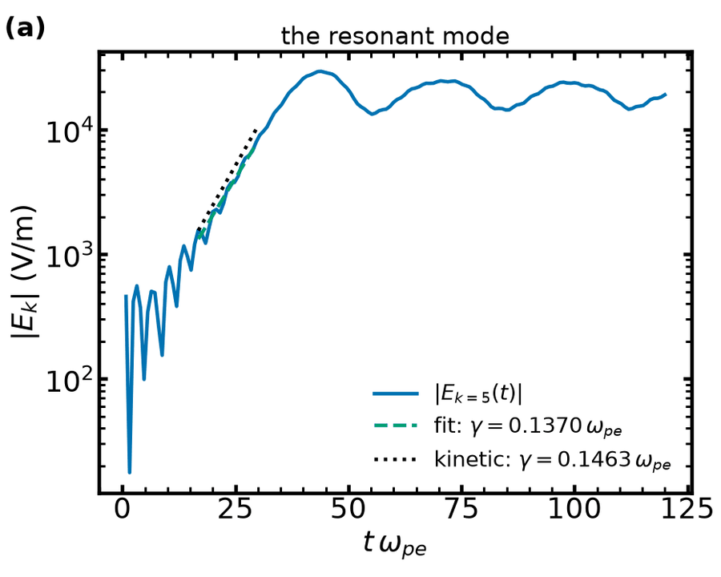</a><br>
<b>Bump on tail</b>: growth rate 6.3 % from the kinetic root, then the quasilinear plateau.<br>
<a href="examples/2_intermediate/bump_on_tail.py"><code>2_intermediate/bump_on_tail.py</code></a> · <a href="https://jax-in-cell.readthedocs.io/en/latest/examples/bump_on_tail.html">docs</a></td>
</tr>
<tr>
<td width="50%" valign="top"><a href="https://jax-in-cell.readthedocs.io/en/latest/examples/compare_models.html">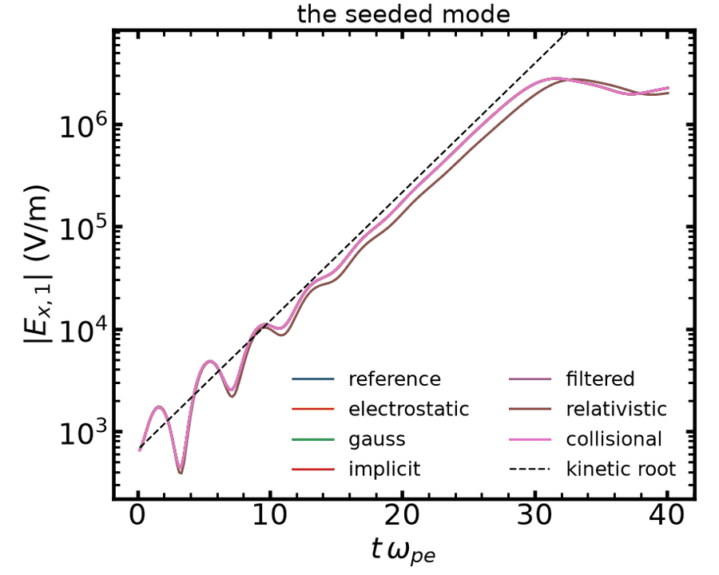</a><br>
<b>Seven solver settings</b>: one two-stream problem: electrostatic, Gauss, filtered, collisional identical (3.3 %); implicit 3.1 %; relativistic 1.1 %.<br>
<a href="examples/2_intermediate/compare_models.py"><code>2_intermediate/compare_models.py</code></a> · <a href="https://jax-in-cell.readthedocs.io/en/latest/examples/compare_models.html">docs</a></td>
<td width="50%" valign="top"><a href="https://jax-in-cell.readthedocs.io/en/latest/examples/electron_field.html">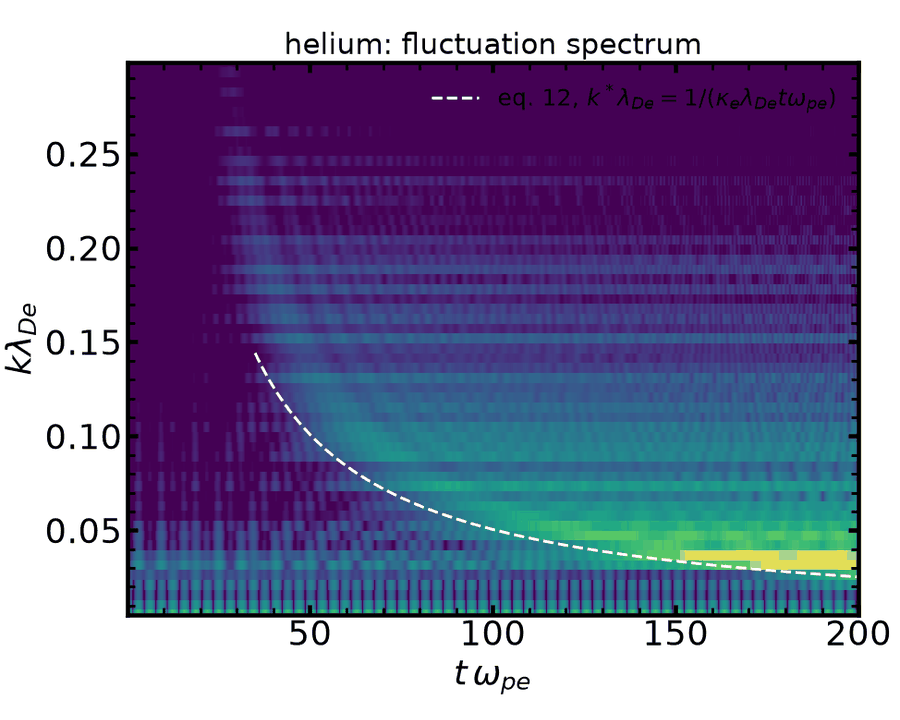</a><br>
<b>Electron-field instability</b>: growth in a uniform field (Beving et al. 2023); peak at 1.14× eq. 12; the growth is set by the discrete ions.<br>
<a href="examples/3_advanced/electron_field.py"><code>3_advanced/electron_field.py</code></a> · <a href="https://jax-in-cell.readthedocs.io/en/latest/examples/electron_field.html">docs</a></td>
</tr>
<tr>
<td width="50%" valign="top"><a href="https://jax-in-cell.readthedocs.io/en/latest/examples/output_and_restart.html">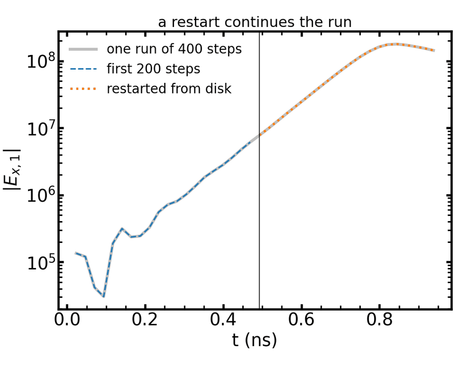</a><br>
<b>Output and restart</b>: a restart from disk is bit-identical; openPMD read back to 1e-18 m.<br>
<a href="examples/2_intermediate/output_and_restart.py"><code>2_intermediate/output_and_restart.py</code></a> · <a href="https://jax-in-cell.readthedocs.io/en/latest/examples/output_and_restart.html">docs</a></td>
<td width="50%" valign="top"><a href="https://jax-in-cell.readthedocs.io/en/latest/examples/parameters_and_sampling.html">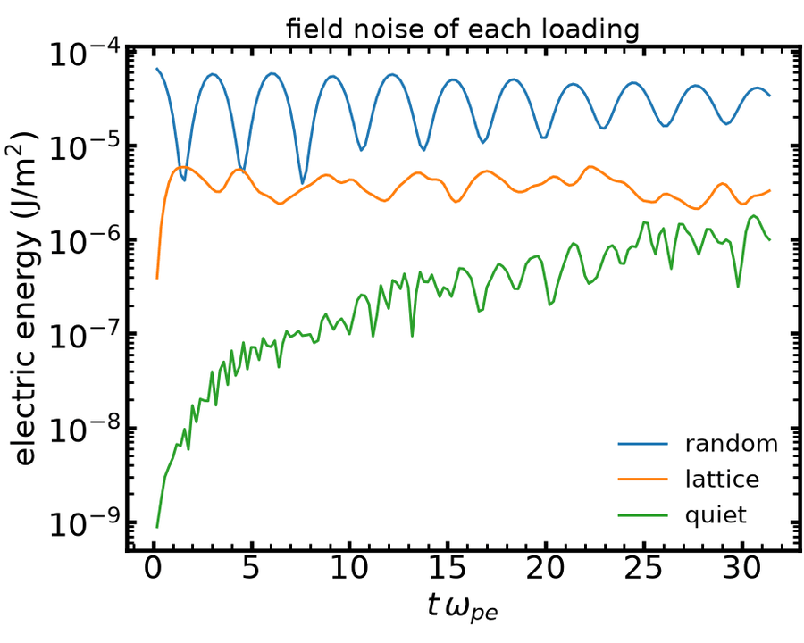</a><br>
<b>Parameters and sampling</b>: random loading at the Poisson $1/\sqrt{N}$ (0.11 vs 0.10); lattice and quiet starts 30× quieter.<br>
<a href="examples/1_basic/parameters_and_sampling.py"><code>1_basic/parameters_and_sampling.py</code></a> · <a href="https://jax-in-cell.readthedocs.io/en/latest/examples/parameters_and_sampling.html">docs</a></td>
</tr>
</table>

### Conservation and time integration

<table>
<tr>
<td width="50%" valign="top"><a href="https://jax-in-cell.readthedocs.io/en/latest/examples/conservation.html">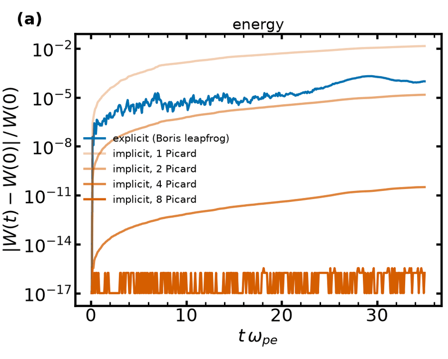</a><br>
<b>Energy, momentum, charge</b>: implicit scheme: energy 3e-16, Gauss law 7e-15; explicit: Gauss law to round-off.<br>
<a href="examples/3_advanced/conservation.py"><code>3_advanced/conservation.py</code></a> · <a href="https://jax-in-cell.readthedocs.io/en/latest/examples/conservation.html">docs</a></td>
<td width="50%" valign="top"><a href="https://jax-in-cell.readthedocs.io/en/latest/examples/conservation.html">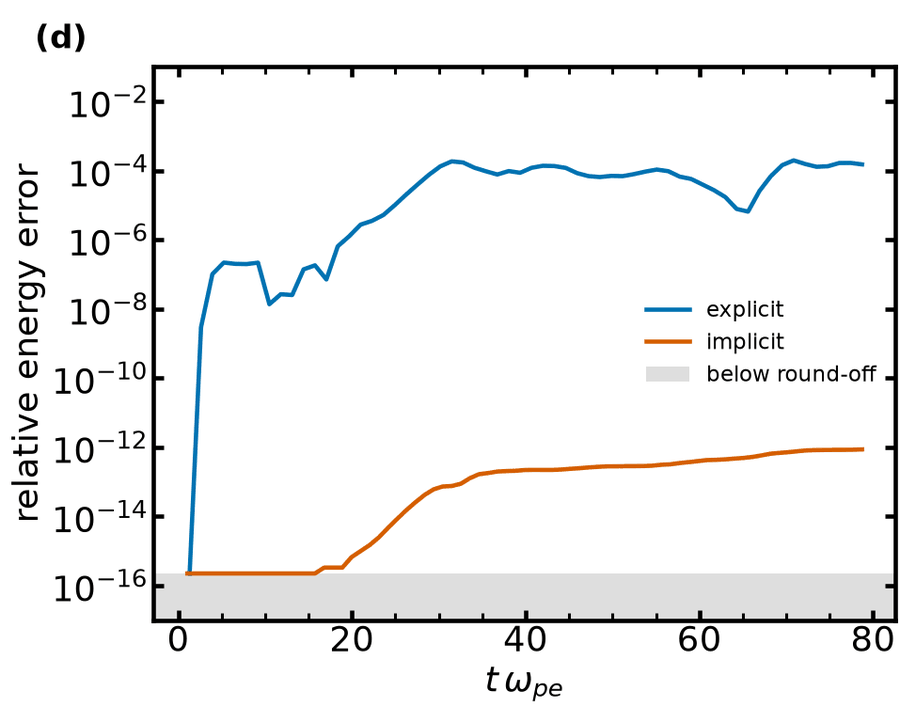</a><br>
<b>Explicit and implicit</b>: at 4× the explicit step the implicit scheme keeps Landau and two-stream rates (1.6 %, 3.0 %) and energy to 1e-12.<br>
<a href="examples/3_advanced/conservation.py"><code>3_advanced/conservation.py</code></a> · <a href="https://jax-in-cell.readthedocs.io/en/latest/examples/conservation.html">docs</a></td>
</tr>
<tr>
<td width="50%" valign="top"><a href="https://jax-in-cell.readthedocs.io/en/latest/examples/invariants.html">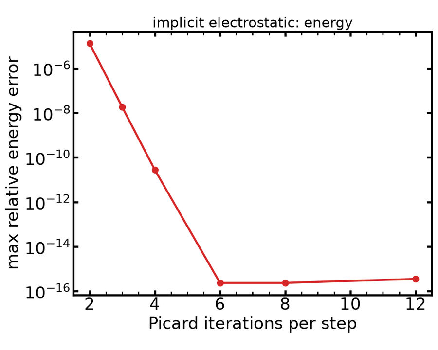</a><br>
<b>What the integrators conserve</b>: implicit electrostatic energy at round-off after 6 Picard iterations; collisions keep the leapfrog's $\Delta t^2$ energy error.<br>
<a href="examples/3_advanced/invariants.py"><code>3_advanced/invariants.py</code></a> · <a href="https://jax-in-cell.readthedocs.io/en/latest/examples/invariants.html">docs</a></td>
<td width="50%" valign="top"><a href="https://jax-in-cell.readthedocs.io/en/latest/examples/collisions.html">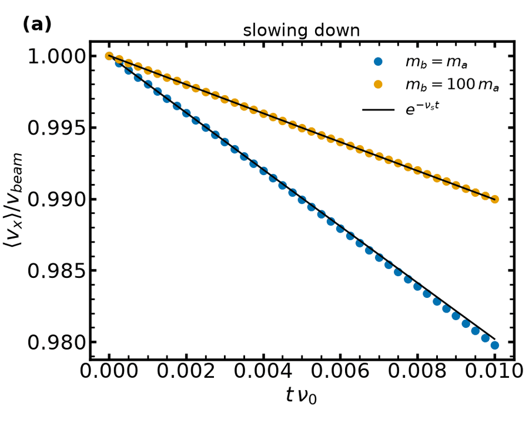</a><br>
<b>Coulomb collisions</b>: Takizuka-Abe against four Fokker-Planck relaxation rates, 2.5 % at worst.<br>
<a href="examples/2_intermediate/collisions.py"><code>2_intermediate/collisions.py</code></a> · <a href="https://jax-in-cell.readthedocs.io/en/latest/examples/collisions.html">docs</a></td>
</tr>
</table>

### 1D2V: a magnetic field the plasma grows itself

<table>
<tr>
<td width="50%" valign="top"><a href="https://jax-in-cell.readthedocs.io/en/latest/examples/weibel.html">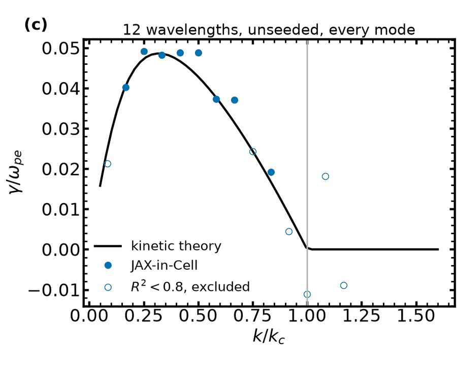</a><br>
<b>Weibel instability</b>: every mode of an unseeded 12-wavelength box against the transverse kinetic dispersion relation: 7.2 % mean.<br>
<a href="examples/2_intermediate/weibel.py"><code>2_intermediate/weibel.py</code></a> · <a href="https://jax-in-cell.readthedocs.io/en/latest/examples/weibel.html">docs</a></td>
<td width="50%"></td>
</tr>
</table>

### Sheaths and walls

<table>
<tr>
<td width="50%" valign="top"><a href="https://jax-in-cell.readthedocs.io/en/latest/examples/sheath_unmagnetized.html">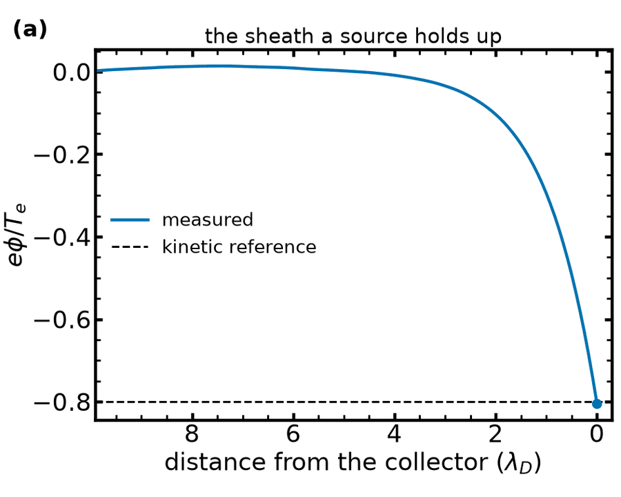</a><br>
<b>Unmagnetized sheath</b>: floating potential 0.6 % and densities 2 % from kinetic sheath theory; net current 0.02 %.<br>
<a href="examples/1_basic/sheath_unmagnetized.py"><code>1_basic/sheath_unmagnetized.py</code></a> · <a href="https://jax-in-cell.readthedocs.io/en/latest/examples/sheath_unmagnetized.html">docs</a></td>
<td width="50%" valign="top"><a href="https://jax-in-cell.readthedocs.io/en/latest/examples/sheath_magnetized.html">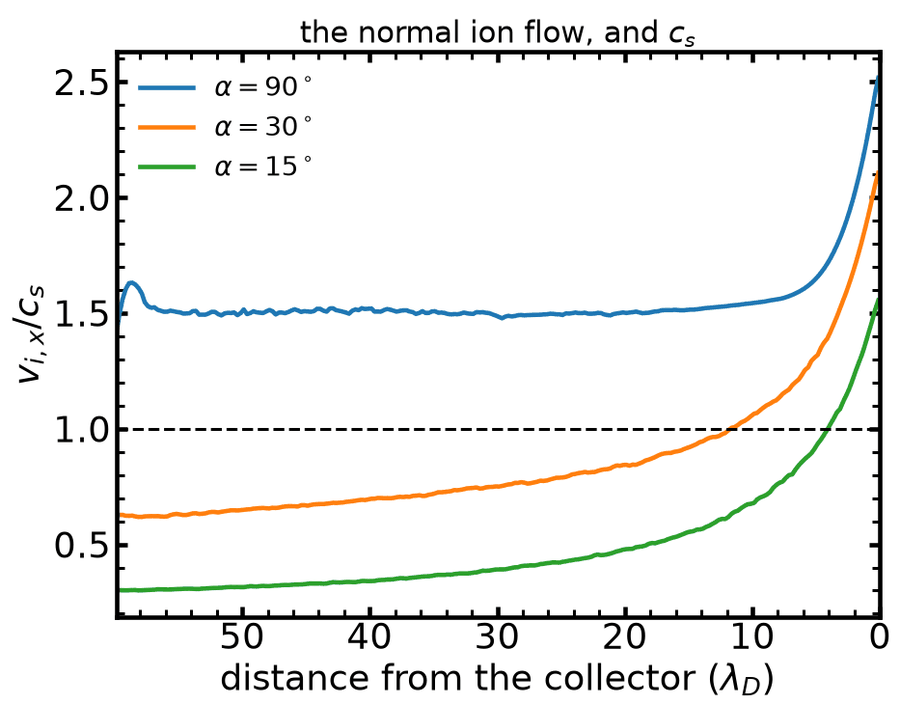</a><br>
<b>Oblique magnetic field</b>: Chodura's magnetic presheath: ions enter along the field, reach $c_s$ normal to the wall.<br>
<a href="examples/2_intermediate/sheath_magnetized.py"><code>2_intermediate/sheath_magnetized.py</code></a> · <a href="https://jax-in-cell.readthedocs.io/en/latest/examples/sheath_magnetized.html">docs</a></td>
</tr>
<tr>
<td width="50%" valign="top"><a href="https://jax-in-cell.readthedocs.io/en/latest/examples/sheath_reflection.html">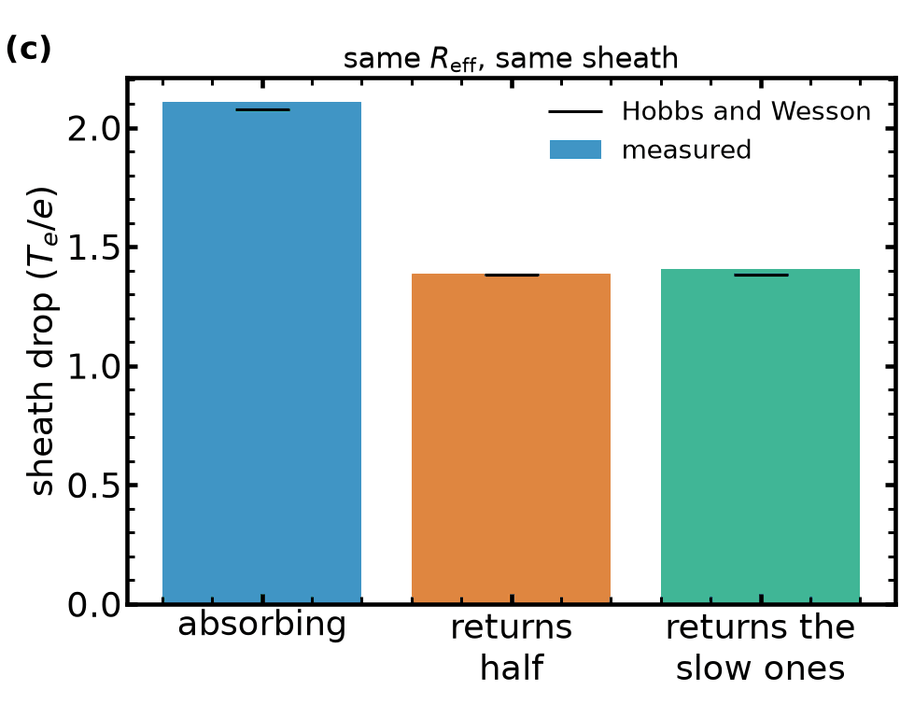</a><br>
<b>Sheath with reflection</b>: sheath drop against Hobbs and Wesson, with and without electron reflection, 2.0 %.<br>
<a href="examples/2_intermediate/sheath_reflection.py"><code>2_intermediate/sheath_reflection.py</code></a> · <a href="https://jax-in-cell.readthedocs.io/en/latest/examples/sheath_reflection.html">docs</a></td>
<td width="50%" valign="top"><a href="https://jax-in-cell.readthedocs.io/en/latest/examples/wall_reflection.html">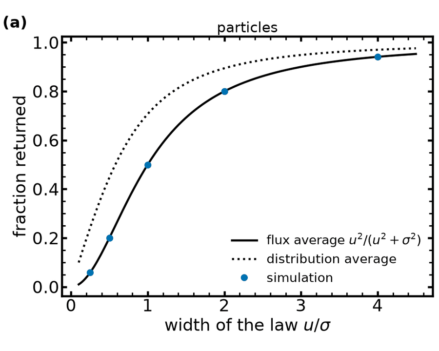</a><br>
<b>Partly reflecting wall</b>: returns the flux average of its reflection law to 2e-4.<br>
<a href="examples/2_intermediate/wall_reflection.py"><code>2_intermediate/wall_reflection.py</code></a> · <a href="https://jax-in-cell.readthedocs.io/en/latest/examples/wall_reflection.html">docs</a></td>
</tr>
<tr>
<td width="50%" valign="top"><a href="https://jax-in-cell.readthedocs.io/en/latest/examples/grazing_sheath.html">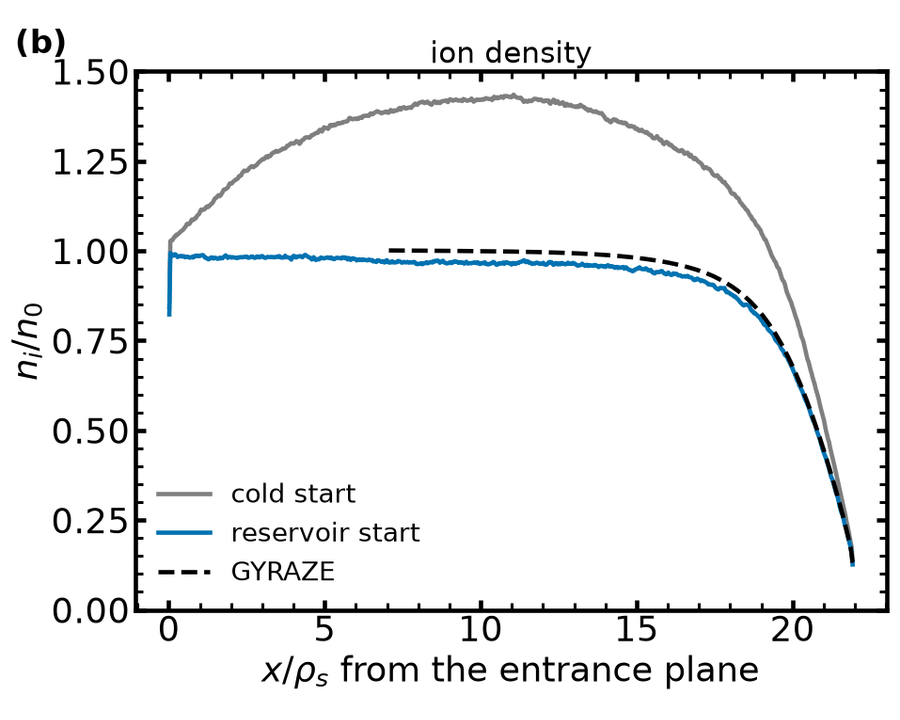</a><br>
<b>Grazing-incidence sheath</b>: against GYRAZE at 5°: six of seven quantities within tolerance after the entrance fix; the matched run is pending.<br>
<a href="examples/3_advanced/grazing_sheath.py"><code>3_advanced/grazing_sheath.py</code></a> · <a href="https://jax-in-cell.readthedocs.io/en/latest/examples/grazing_sheath.html">docs</a></td>
<td width="50%"></td>
</tr>
</table>

### Magnetised plasma and external fields

<table>
<tr>
<td width="50%" valign="top"><a href="https://jax-in-cell.readthedocs.io/en/latest/examples/external_fields_3d.html">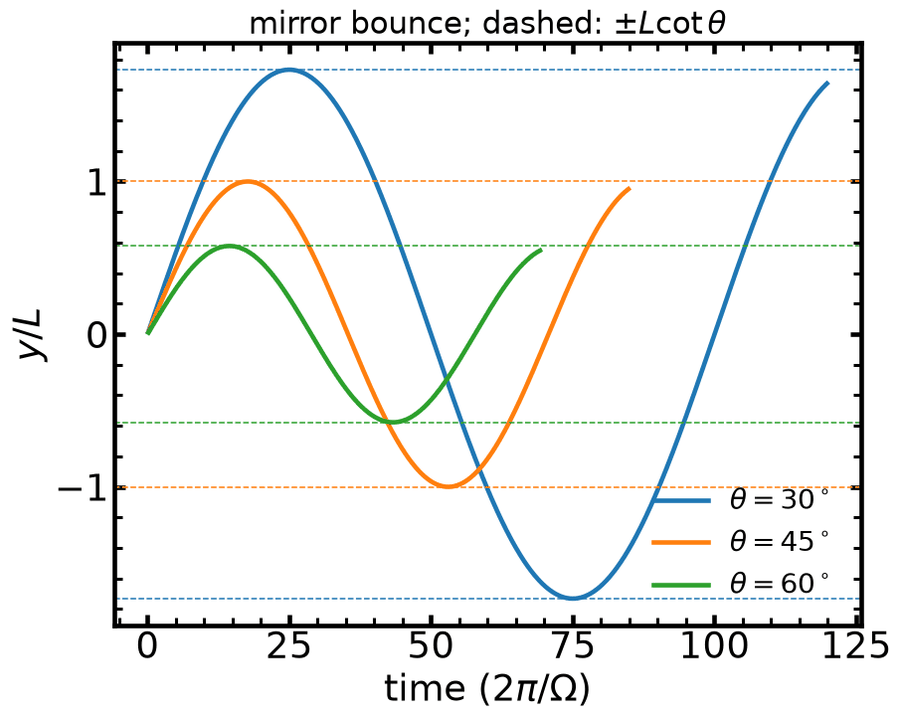</a><br>
<b>Magnetic mirror</b>: turning points at $L\cot\theta$ to 0.01 %, $\mu$ constant to 2e-5 while $B$ changes fourfold.<br>
<a href="examples/2_intermediate/external_fields_3d.py"><code>2_intermediate/external_fields_3d.py</code></a> · <a href="https://jax-in-cell.readthedocs.io/en/latest/examples/external_fields_3d.html">docs</a></td>
<td width="50%" valign="top"><a href="https://jax-in-cell.readthedocs.io/en/latest/examples/external_fields_3d.html">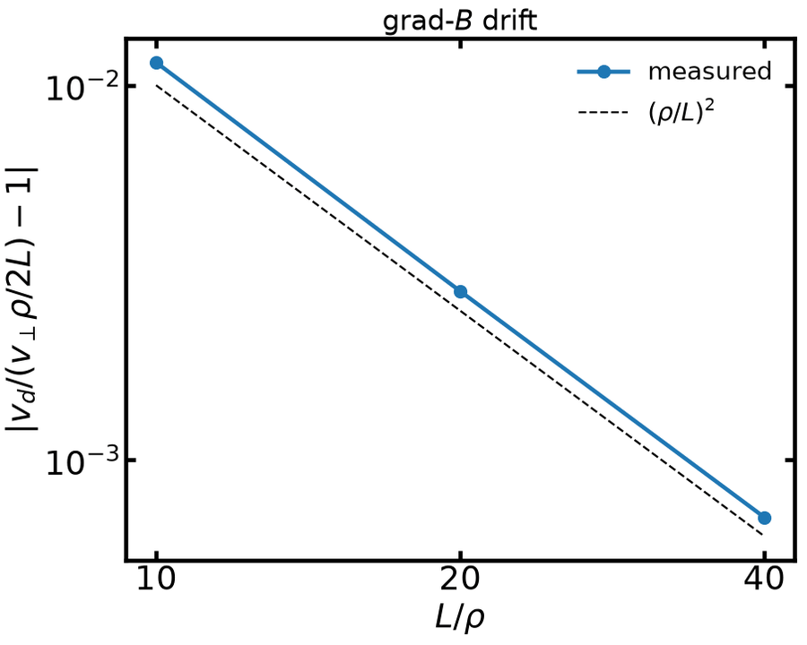</a><br>
<b>Grad-B drift</b>: guiding-centre drift within $(\rho/L)^2$ of $v_\perp\rho/2L$: 0.07 % at $L = 40\rho$.<br>
<a href="examples/2_intermediate/external_fields_3d.py"><code>2_intermediate/external_fields_3d.py</code></a> · <a href="https://jax-in-cell.readthedocs.io/en/latest/examples/external_fields_3d.html">docs</a></td>
</tr>
</table>

### Optimisation

<table>
<tr>
<td width="50%" valign="top"><a href="https://jax-in-cell.readthedocs.io/en/latest/examples/sheath_optimization.html">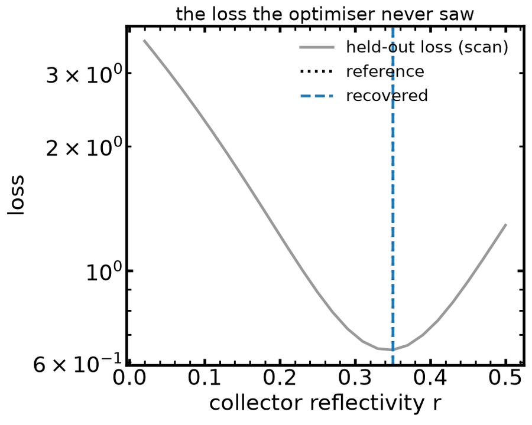</a><br>
<b>Inverse problem</b>: a wall's reflectivity recovered from the sheath it holds, 0.344 ± 0.021 against 0.35 on held-out data; gradients match finite differences to 8–10 digits.<br>
<a href="examples/3_advanced/sheath_optimization.py"><code>3_advanced/sheath_optimization.py</code></a> · <a href="https://jax-in-cell.readthedocs.io/en/latest/examples/sheath_optimization.html">docs</a></td>
<td width="50%" valign="top"><a href="https://jax-in-cell.readthedocs.io/en/latest/examples/optimize_two_stream.html">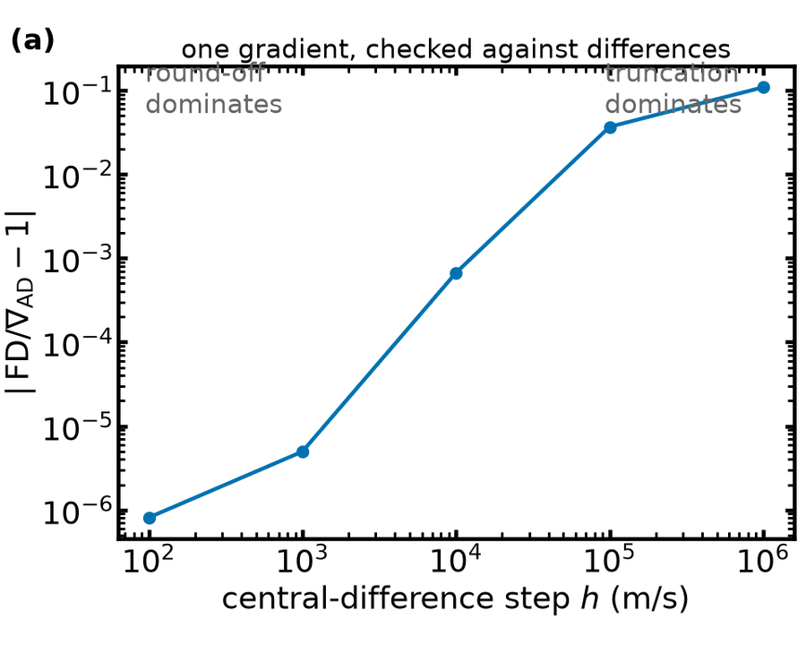</a><br>
<b>Gradients through the run</b>: <code>jax.grad</code> of the growth rate agrees with finite differences; 12 ascent steps find the fastest-growing drift to 0.1 %.<br>
<a href="examples/3_advanced/optimize_two_stream.py"><code>3_advanced/optimize_two_stream.py</code></a> · <a href="https://jax-in-cell.readthedocs.io/en/latest/examples/optimize_two_stream.html">docs</a></td>
</tr>
</table>

### Speed

<p align="center">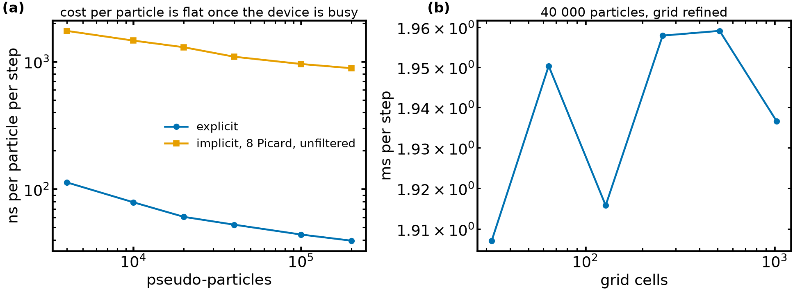</p>

| what | cost |
|---|---|
| explicit step, 200 000 particles | 39 ns per particle per step |
| implicit step, 8 Picard iterations | 890 ns per particle per step |
| 1024 cells, 40 000 particles | 1.9 ms per step |
| two-stream, 256 000 pseudo-electrons, 900 steps | 20.7 s on the laptop CPU, 4.31 s on an NVIDIA RTX A4000 (4.8×) |

Measured on a shared laptop CPU (Apple M3 Max, JAX 0.11, load about 10), so an idle machine is
faster; `docs/scripts/fig_scaling.py` reproduces it, and the same code runs on a GPU or TPU
without change.

## Run one from a file

`inputs/` holds a TOML file for each of the runs above. Every table in it is a constructor
and nothing is ignored, so a misspelled key is an error in the file rather than a surprise in
the answer:

```bash
jaxincell inputs/two_stream.toml                                  # run and animate
jaxincell inputs/landau_damping.toml --no-plot                    # headless
jaxincell inputs/weibel.toml --save weibel --movie weibel.mp4     # arrays, provenance, video
```

`--save DIR` writes `fields.npz`, a `run.json` with the settings and the versions, precision,
device and commit that produced them, and a copy of the input file. `--steps` and `--seed`
override the file; `--plot`/`--no-plot` override its plotting. Scans and optimisation are not
in the file format on purpose: those are programs, and `load_toml` hands you the `Simulation`
to write them around.

## Documentation

The [documentation](https://jax-in-cell.readthedocs.io/) contains a tutorial, a
user guide covering every argument and output field, a description of the numerical
methods with their derivations (the Yee grid, shape functions, the charge-conserving
deposit, the Boris and Crank-Nicolson schemes, collisions, filtering, boundaries,
stability limits), the verification against linear kinetic theory, the examples, and
the API reference. To build it locally:

```bash
pip install -e ".[docs]"
sphinx-build -W -b html docs docs/_build/html
```

The figures and every number the text quotes are regenerated with
`python docs/scripts/make_all.py`.

## Testing

```bash
pip install -e ".[dev]"
pytest -q
```

270 tests, about eight minutes, covering every statement and branch. They
are physics tests rather than regression tests: closed-form rates and frequencies,
conservation laws, exact results for the kernels, and the behaviour of the interface.
They run on Python 3.10 to 3.13 on every pull request, together with a build of the
documentation.

## Contributing and citing

Bug reports and feature requests go to the
[issue tracker](https://github.com/uwplasma/JAX-in-Cell/issues), questions to the
[discussions](https://github.com/uwplasma/JAX-in-Cell/discussions), and code through
pull requests, as the
[development guide](https://jax-in-cell.readthedocs.io/en/latest/development.html)
describes. If you use JAX-in-Cell in your work, please cite it, together with JAX and
the papers of the methods you rely on, listed in the
[references](https://jax-in-cell.readthedocs.io/en/latest/numerics/index.html#references).
[`CITATION.cff`](CITATION.cff) is the same entry in the form GitHub's "Cite this
repository" reads:

```bibtex
@software{jaxincell,
  author = {Ma, Longyu and Jorge, Rogerio and Lu, Hongke and Tran, Aaron and Woolford, Christopher},
  title  = {{JAX-in-Cell}: a differentiable particle-in-cell code for plasma physics},
  year   = {2025},
  url    = {https://github.com/uwplasma/JAX-in-Cell}
}
```

## Acknowledgements

JAX-in-Cell was inspired by [PiC-Code-Jax](https://github.com/SeanLim2101/PiC-Code-Jax)
by Sean Lim. Development is supported by the National Science Foundation under grant
PHY-2409066 and by the [UWPlasma](https://rogerio.physics.wisc.edu/) group at the
University of Wisconsin-Madison.

## License

MIT, see [LICENSE](LICENSE).
