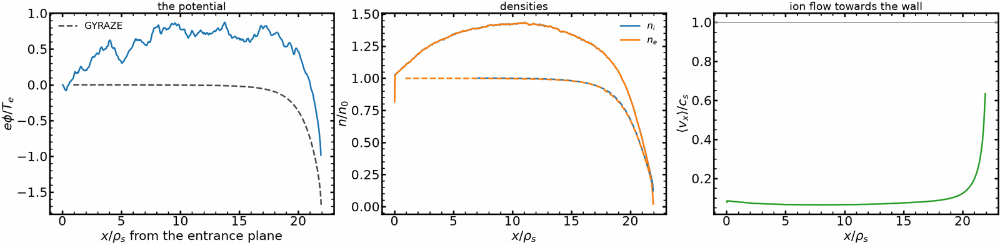

# A sheath at grazing incidence, against GYRAZE

Where the magnetic field meets the wall at a few degrees the plasma-wall transition has two
layers: a **magnetic presheath** a few ion sound gyroradii deep and, inside it, a **Debye
sheath** a few Debye lengths deep {cite}`chodura1982`. GYRAZE solves the two as separate
asymptotic systems in the limit $\lambda_D/\rho_s \to 0$, $\alpha \to 0$; this example runs
the same problem with full orbits and no ordering in $\alpha$.

This page has no committed figure: the run writes its own profiles and figure into
`grazing_sheath/` beside `run.json`. {doc}`sheath_magnetized` is the same physics at
angles a laptop can reach, and carries the figure.

## What is checked

| quantity | measured | reference | deviation |
|---|---|---|---|
| sampled entrance distribution | 400 000 samples | GYRAZE's own $F(v_\parallel, v_\perp)$ | KS distance 0.0024, the sampling floor |
| fraction below $0.1\sqrt{T_i/m_i}$ | under 0.1 % | a Maxwellian would put 8 % there | — |
| mean parallel speed | — | $1.5958\sqrt{T_i/m_i} = 1.128\,c_s$ | — |
| $\phi(x)$ with `--reference=DIR` | the run's profile | the matched composite of a GYRAZE output | reported by the script |

## The entrance condition is the reference's own

GYRAZE prescribes the ion distribution at the magnetic-presheath entrance as

```{math}
F(v_\parallel, v_\perp) \propto v_\parallel^2
\exp\!\left[-\tfrac12 (v_\parallel - u)^2 - \tfrac12 v_\perp^2\right],
```

in units of $\sqrt{T_i/m_i}$, with $u$ fixed by the kinetic Chodura condition. The
$v_\parallel^2$ **is** that condition: it empties the distribution at zero parallel
velocity, because an ion with no parallel velocity at the entrance cannot be there in a
steady grazing-angle presheath {cite}`geraldini2019`. At $T_i = T_e$ the condition gives
$u = 0$.

The example samples it from its own quantile — rejection against a normal of the same width
is not valid, because the ratio $v^2$ is unbounded — and hands the velocities to
{class}`~jaxincell.Source` as `samples`. That is what keeps the correlation the field angle
puts into every Cartesian component: with $\mathbf B$ at $\alpha$ to the wall,
$v_x = v_\parallel\sin\alpha + v_{\perp,1}\cos\alpha$, and no product of three
one-dimensional draws reproduces either that or the hole at $v_\parallel = 0$
({doc}`../user_guide/sources`).

## The manifest

A comparison of two codes is mostly a comparison of conventions, so the run prints them
before anything else and writes them into its `run.json`:

| quantity | this example, and GYRAZE |
|---|---|
| $\alpha$ | the angle to the **wall plane**, so normal incidence is $90°$ |
| $x$ | from the entrance plane towards the wall; $\phi$ measured from that plane |
| $\rho_s$ | $c_s/\Omega_i$ with $c_s = \sqrt{(ZT_e+T_i)/m_i}$ — **not** the Bohm gyroradius, which is smaller by $\sqrt{1+\tau}$ |
| velocities | normalised to $\sqrt{T/m}$, not $\sqrt{2T/m}$ |
| $\gamma$ | $\rho_e/\lambda_D$ at the entrance plane (`gammaflag = 0` in GYRAZE) |
| $\tau$ | the **width parameter** of the distribution above, not a Maxwellian temperature |
| the wall | floating, so its potential is measured and not prescribed |

The separation of scales follows: $\rho_s/\lambda_D = \sqrt{M(1+\tau)}\,\gamma$.

## What it costs, which is the result about full orbits

The reference's own figure — $m_i/m_e = 3600$ at $2.5°$ with $\gamma = 0.3$ — is out of
reach:

| | |
|---|---|
| box | $25\rho_s + 83\lambda_D = 719\ \lambda_D$ |
| ion crossing speed | $c_s\sin 2.5°$ |
| step cap, to resolve the electron gyro-phase | $\omega_{pe}\Delta t = 0.075$ |
| one ion transit | $9.3\times10^6$ steps |

The marker count is worse than the step count. A species carries `emit/every` times its
residence in steps, and an ion stays 465 000 steps at $m_i/m_e = 400$ and $5°$. The ions are
therefore emitted once every $k = \text{residence}/\text{markers}$ steps
(`Source(every=k)`): the pool is then the markers asked for, each carrying $k$ steps of flux
and placed where its orbit has taken it, which moves the stream by
$\Delta x/\text{markers per cell}$ a window. Electrons stay at $k = 1$, their gyro-angle
being a quarter radian a step.

| case | ion $k$ | pool | particle-steps, three transits | laptop | one A4000 |
|---|---|---|---|---|---|
| rehearsal, $m_i/m_e = 400$, $5°$ | 14 | $6.3\times10^4$ | $8.8\times10^{10}$ | 4 h | 1–2 h, estimated |
| matched, $m_i/m_e = 900$, $4°$ | 27 | $9.1\times10^4$ | $3.1\times10^{11}$ | 15 h | 3.5–7 h, estimated |

`--every=1` is the control that the result does not depend on $k$; with $k = 1$ the same two
cases cost 33 and 194 laptop hours.

That is the asymptotic limit doing its job rather than a failure of the run, and it is why
the example has three presets: a smoke run that says it is not grazing, a rehearsal at
$m_i/m_e = 400$ and $5°$ — the cheapest case where GYRAZE still converges, at the edge of
the $5$–$8°$ range its own README calls inaccurate — and `--matched` for a machine that can
afford it.

## Against GYRAZE

With `--reference=DIR` the run is compared against a GYRAZE output directory and its
`manifest.json`, which GYRAZE's missing licence keeps outside this repository.

| convention | GYRAZE | this code |
|---|---|---|
| presheath length | Bohm gyroradius $\rho_B = \rho_s/\sqrt{1+\tau}$ | metres, converted |
| Debye-sheath length | $\rho_e$ | $\rho_e = \gamma\lambda_D$ |
| $\gamma = \rho_e/\lambda_D$ | at the Debye-sheath entrance (`gammaflag = 0`) | at the entrance plane, `--gamma` |

A matched run passes the entrance-plane value its manifest names with `--gamma`. Seven
quantities are compared, each against a tolerance declared in the script: three standard errors
of the run's block means, plus the first order in $\lambda_D/\rho_B$ and $\alpha$ that the
asymptotic reference drops, plus the grid's second-order error. Every number and verdict goes
to `run.json`, and the reference is drawn dashed on the figure.

### The rehearsal: $m_i/m_e = 400$ at 5°, $\gamma = 0.54$

Default preset, three ion transits, 5.4 h on one A4000; GYRAZE reference at $\epsilon =
\lambda_D/\rho_B = 0.25$, where the reference's dropped orders are large.

| quantity | this code | GYRAZE | tolerance | verdict |
|---|---|---|---|---|
| Debye-sheath drop $[T_e/e]$ | −0.588 | −0.526 | 0.20 | pass |
| mean ion impact energy $[T_e]$ | 4.43 | 4.67 | 0.66 | pass |
| wall potential $[T_e/e]$ | −1.03 | −1.68 | 2.9 (noise 0.81) | pass, uninformative |
| presheath potential, max diff | 0.89 | — | 2.9 | pass, uninformative |
| ion flux $[n_0\sqrt{T_e/m_e}]$ | 0.0074 | 0.0070 | 0.0003 | fail (+6 %) |
| ion density, max diff $[n_0]$ | 0.44 | — | 0.40 | fail |
| electron density, max diff $[n_0]$ | 0.44 | — | 0.40 | fail |



The Debye sheath and the impact energy agree. The magnetic presheath does not: the ion density
at the entrance plane is 0.82 $n_0$, the potential rises about 0.8 $T_e/e$ above the plane,
ions slow along $\mathbf B$ to half the reference flow, and the density piles up to 1.4 $n_0$.
The likely cause, not yet tested: the open entrance plane absorbs ions that gyrate back across
it within one gyroradius, so the plane is not the neutral, field-free entrance GYRAZE assumes.
The matched run waits on a fix of the entrance treatment.

## How to run

```bash
python examples/3_advanced/grazing_sheath.py --quick            # a smoke run, about two minutes
python examples/3_advanced/grazing_sheath.py                    # the rehearsal
python examples/3_advanced/grazing_sheath.py --matched          # inside the reference's range
python examples/3_advanced/grazing_sheath.py --reference=DIR    # compare against a GYRAZE output
```

`--markers=N` and `--transits=T` scale any of them for a first look.

GYRAZE is at <https://github.com/alessandrogeraldini/GYRAZE> and has no licence file, so it
is run separately and read, never vendored here. With `--reference=DIR` the example reads
the `phi_n_MP.txt` and `phi_n_DS.txt` of a GYRAZE output directory and reports the
difference; the profile to compare against is the matched composite
$\phi(x) = \phi_{\rm MP}(x/\rho_s) + \phi_{\rm DS}(x/\lambda_D)$, which tends to $\phi_w$ at
the wall, to $\phi_{\rm DSE}$ in the overlap and to zero upstream, with the densities
multiplying the same way.

Two things to know about those files before trusting them:

* One density column of each is written past the index the density solver filled, so the
  far field reads as exactly zero and has to be truncated.
* `misc_output.txt` is written as net current, $\tfrac12 v_{\rm cut}^2$ (a magnitude, while
  the printout carries the sign), $Q_e$, $\sum Q_i$, $\Gamma_e$, $\sum\Gamma_i$.

## Scope

Full orbits, no ordering in $\alpha$, and a floating wall. It is not a gyrokinetic
calculation and does not assume monotonicity; where the reference assumes both, a
disagreement is a statement about the ordering and not automatically an error in either
code.
