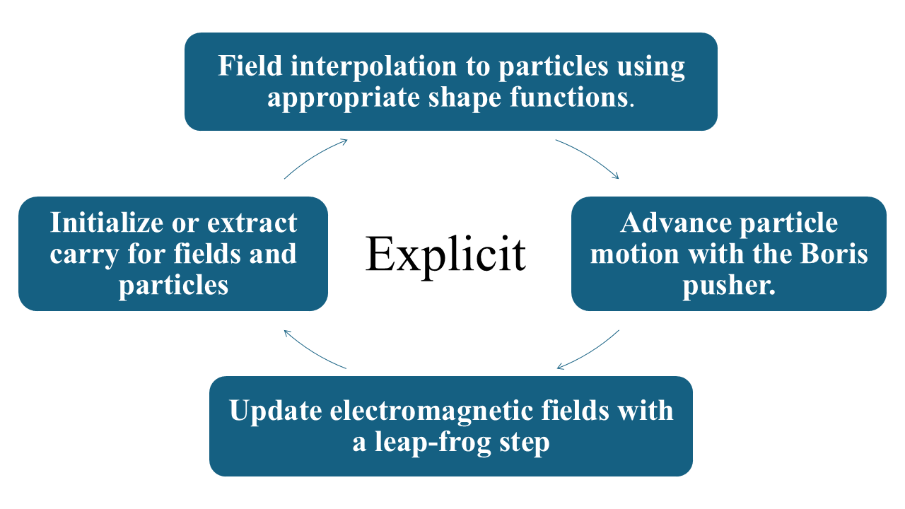
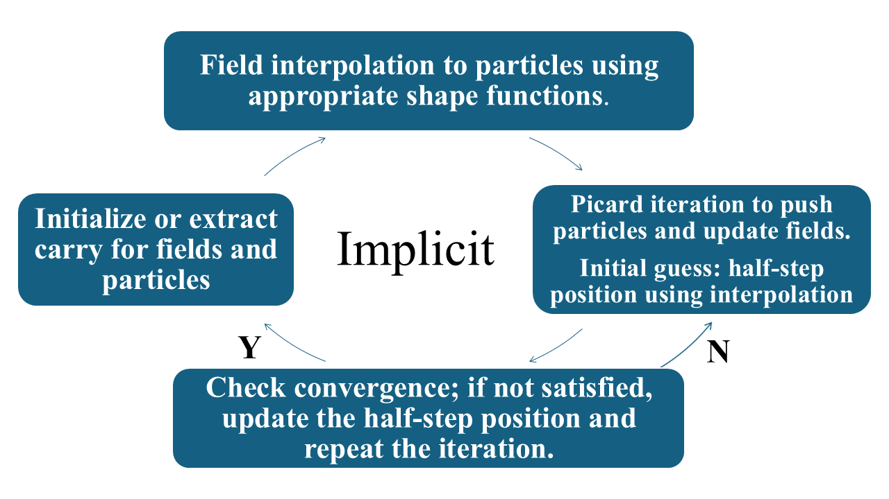

# Summary

A plasma is a collection of free ions and electrons whose self-generated and external electromagnetic fields drive collective behavior. Particle-in-Cell (PIC) simulation is a powerful tool in plasma physics, offering a fully kinetic description and enabling exploration of complex interactions in fusion devices and astrophysical plasmas.

Our code, **JAX-in-Cell**, implements a 1D3V PIC framework in JAX and is built to be open-source, user-friendly, and developer-friendly, written entirely in Python in contrast to many other PIC codes implemented in legacy languages such as Fortran or mixed-language frameworks. Utilizing JAX, the code achieves high performance through GPU acceleration, just-in-time compilation, vectorized operations, and automatic differentiation, and it is well-suited for both educational-scale demonstrations—such as reproducing Landau damping and two-stream instability—and research-scale simulations such as rapid optimization.

Furthermore, although the classic Boris push is simple and robust, long-term PIC simulations can experience energy drift (numerical heating). To mitigate this, **JAX-in-Cell** implements both the standard Boris algorithm and an implicit, discretely energy-conserving method, providing improved energy conservation for extended simulations.

# Structure

The core of our Particle-in-Cell (PIC) code is based on the **Vlasov–Maxwell system**, which governs the self-consistent evolution of the particle distribution function and electromagnetic fields:

$$
\partial_t f_s + v \cdot \nabla f_s + \frac{q_s}{m_s} (E + v \times B) \cdot \nabla_{\mathbf{u}} f_s = 0,
$$

$$
\frac{\partial B}{\partial t} + \nabla \times E = 0,
$$

$$
\varepsilon_0 \frac{\partial E}{\partial t} - c^2 \nabla \times B + j = 0.
$$

Here, $f_s$ denotes the distribution function for species $s$, $v$ is the particle velocity, $q_s$ and $m_s$ are the particle charge and mass, $E$ and $B$ are the electric and magnetic fields, $\varepsilon_0$ is the vacuum permittivity, and $j$ is the current density.

In a typical PIC framework, the distribution function is discretized using pseudo-particles $p$ as

$$
f_s(x, u) \approx \sum_{p \in s} w_p\, \delta(x - x_p)\, \delta(u - u_p),
$$

where weight $w_p = nL/N$, with $n$ number density, $L$ the spatial domain length and $N$ the number of pseudo-particles. Then, spatial domain is divided into $N_x$ uniform cells with spacing $\Delta x$ and advanced in time by $\Delta t$. To reduce numerical noise, each pseudo-particle is represented by a **quadratic spline shape function** spanning three cells. Under the **Courant–Friedrichs–Lewy (CFL)** condition, particles traverse at most one cell per timestep. Accordingly, current density $j$ is computed from **continuity equation** using a discretely charge-conserving scheme consistent with the shape function:

$$
j^n_i = \frac{\Delta x}{\Delta t} \sum_{k=i-3}^{i+2} \left( \rho^{n+1/2}_{k+1/2} - \rho^{n-1/2}_{k+1/2} \right),
$$

where $i$ denote cell number and $n$ for timestep. Moreover, We employ periodic boundary conditions, adding ghost cells at both ends of the spatial grid. Because the particle shape function spans three grid points, three ghost cells are required in total: two on the left and one on the right. Field interpolation is also required since shape functions extend across multiple cells. For either the electric or magnetic field $F$ with ghost cells:

$$
F(x_p)=
\frac{1}{2} F_{i-1} 
\left(
\frac{1}{2} + \frac{x_i - x_p}{\Delta x}
\right)^2
+
F_i 
\left(
\frac{3}{4} - \frac{(x_i - x_p)^2}{\Delta x^2}
\right)
+
\frac{1}{2} F_{i+1}
\left(
\frac{1}{2} - \frac{x_i - x_p}{\Delta x}
\right)^2.
$$

We implement two time-evolution methods:  
(1) an **explicit** Boris algorithm, and  
(2) an **implicit** Crank–Nicolson scheme solved via Picard iteration.

{ width=49% }
{ width=49% }

# Capabilities

To verify the accuracy of the algorithms, we benchmarked **Landau damping** and **two-stream instability**. The plasma is neutralized by a uniform ion background and confined within a periodic domain of length $L$. The initial distribution with position perturbation is

$$
f_e(x, v, t = 0) = f_{e0}(v)\left[ 1 + a \cos( k x)\right],
$$

where $a$ is the perturbation amplitude and $k$ the perturbation wavenumber. The warm plasma dispersion relation is

$$
1 + \frac{1}{2k^2\lambda_D^2}
\left[  2 + \xi_1 Z(\xi_1)+\xi_2 Z(\xi_2)\right] = 0, \quad
\xi_i=\frac{\omega}{kv_{th}}-\frac{v_{b_i}}{v_{th}},
$$

where $Z$ is the Fried–Conte plasma dispersion function. The complex frequency $\omega$ yields both oscillation and damping/growth rates.

For **Landau damping**:
(i) Perturbation: $a = 0.025$, $k\lambda_D = 1/2$
(ii) Velocities: $v_{b_1} = v_{b_2} = 0$, $v_{th} = 0.35\,c$
(iii) Discretization: $N = 40{,}000$, $N_x = 32$, $\Delta x = 0.4\lambda_D$ and $\Delta t = 0.1\,\omega_{pe}^{-1}$

For **two-stream instability**:
(i) Perturbation: $a = 5\times10^{-7}$, $k\lambda_D = 1/8$
(ii) Velocities: $v_{b_1} = -v_{b_2} = 0.2\,c$, $v_{th} = 0.05\,c$
(iii) Discretization: $N = 10{,}000$, $N_x = 100$, $\Delta x = 0.5 \lambda_D$ and $\Delta t = 0.1\,\omega_{pe}^{-1}$

Although the results show good agreement with analytical predictions, the Landau damping simulation is highly sensitive to the initialization, particularly the perturbation amplitude.

We then benchmarked performance by comparing CPU and GPU runtimes and examined how the total runtime scales with the number of pseudoparticles.  
Ten drift velocities from the two-stream dispersion relation were simulated as representative test cases.

Finally, we investigated the **Weibel instability**, which arises in anisotropic plasmas and leads to spontaneous magnetic field generation.  
The plasma is initialized with anisotropic velocity distribution, and we track magnetic field evolution. During the instability, the magnetic field organizes into filamentary structures perpendicular to the velocity anisotropy. Initially, multiple small filaments form, and as the system evolves, they merge into larger-scale structures.

# References

*References temporarily removed for build.*
