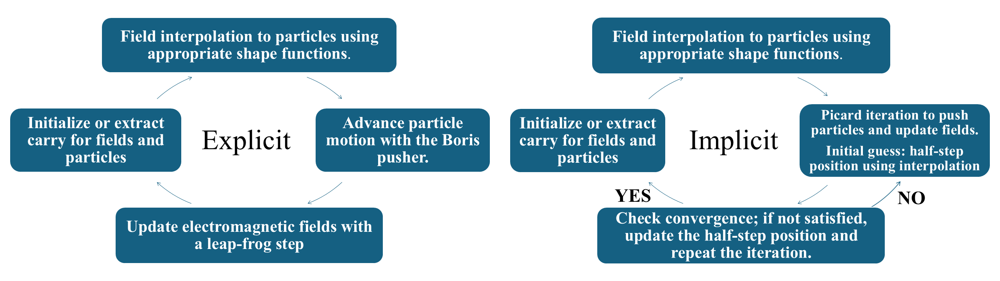

# Summary

A plasma is a collection of free ions and electrons whose self-generated and external electromagnetic fields drive collective behavior. Particle-in-Cell (PIC) simulation is a powerful tool in plasma physics, offering a fully kinetic description and enabling exploration of complex interactions in fusion devices and astrophysical plasmas[@birdsall1991plasma].

Our code, **JAX-in-Cell**, implements a 1D3V PIC framework in JAX and is built to be open-source, user-friendly, and developer-friendly, written entirely in Python in contrast to many other PIC codes implemented in legacy languages such as Fortran[@epochPic] or mixed-language frameworks[@vpicLANL]. Utilizing JAX, the code achieves high performance through GPU acceleration, just-in-time compilation, vectorized operations, and automatic differentiation, and it is well-suited for both educational-scale demonstrations—such as reproducing Landau damping and two-stream instability—and research-scale simulations such as rapid optimization.

Furthermore, although the classic Boris push is simple and robust, long-term PIC simulations can experience energy drift (numerical heating). To mitigate this, **JAX-in-Cell** implements both the standard Boris algorithm[@boris1970relativistic] and an implicit, discretely energy-conserving method[@chen2011energy], providing improved energy conservation for extended simulations.

# Structure

The core of our Particle-in-Cell (PIC) code is based on the Vlasov–Maxwell system, which governs the self-consistent evolution of the particle distribution function and electromagnetic fields:

\begin{equation}
\partial_t f_s + \mathbf{v} \cdot \nabla f_s + \frac{q_s}{m_s} (\mathbf{E} + \mathbf{v} \times \mathbf{B}) \cdot \nabla_{\mathbf{v}} f_s = 0,
\end{equation}

\begin{equation}
\frac{\partial \mathbf{B}}{\partial t} + \nabla \times \mathbf{E} = 0,
\end{equation}

\begin{equation}
\varepsilon_0 \frac{\partial \mathbf{E}}{\partial t} - c^2 \nabla \times \mathbf{B} + \mathbf{j} = 0.
\end{equation}

Here, $f_s$ denotes the distribution function for species $s$, $\mathbf{v}$ is the particle velocity, $q_s$ and $m_s$ are the particle charge and mass, $\mathbf{E}$ and $\mathbf{B}$ are the electric and magnetic fields, $\varepsilon_0$ is the vacuum permittivity, and $\mathbf{j}$ is the current density.

In a typical 1D3V PIC framework, the distribution function is discretized using pseudo-particles labeled $p$ as

\begin{equation}
f_s(x, \mathbf{v}) \approx \sum_{p \in s} w_p\, \delta(x - x_p)\, \delta(\mathbf{v} - \mathbf{v_p}),
\end{equation}

where $x_p$ denotes the position, $\mathbf{v_p}$ denotes the three-component velocity, the weight is given by $w_p = n_0L/N$, with $n_0$ number density, $L$ the spatial domain length and $N$ the number of pseudo-particles for that species. Then, spatial domain is divided into $N_x$ uniform cells with spacing $\Delta x$ and advanced in time by $\Delta t$. To mitigate numerical noise, each pseudo-particle is represented by a triangular shape function spanning three grid cells, and same kernel is used consistently for both the particle-to-grid charge deposition and the grid-to-particle field interpolation [@hockney1988computer]. Under the Courant–Friedrichs–Lewy (CFL) condition, particles traverse at most one cell per timestep. Accordingly, current density $j$ is computed from continuity equation using a discretely charge-conserving scheme[@villasenor1992rigorous] consistent with the shape function:

\begin{equation}
j^n_i = \frac{\Delta x}{\Delta t} \sum_{k=i-3}^{i+2} \left( \rho^{n+1/2}_{k+1/2} - \rho^{n-1/2}_{k+1/2} \right),
\end{equation}

where $i$ denote cell number, $n$ for timestep $\rho$ for charge density.

We implement two time-evolution methods. See \autoref{fig:algorithm}.
(1) an explicit Boris algorithm[@boris1970relativistic], and  
(2) an implicit Crank–Nicolson scheme solved via Picard iteration[@chen2011energy].

# Capabilities
The code is designed to simulate plasma dynamics, giving users full control over a wide range of physical and numerical parameters, including particle distributions, thermal velocities, drift speeds, boundary conditions, external fields, and numerical tolerances. It supports both relativistic and non-relativistic particle dynamics and offers flexible options for initializing perturbations and multi-stream velocity configurations.

To facilitate analysis, the code automatically computes key quantities such as spatial scales (e.g., Debye length, skin depth), plasma frequency, and diagnostics of electric and magnetic field energies, as well as kinetic energies of electrons and ions to monitor energy conservation.

For example, the code can simulate phenomena such as Landau damping, the two-stream instability, and the Weibel instability. In these simulations, the plasma is neutralized by a uniform ion background and confined within a periodic domain of length $L$. The initial electron distribution with a position perturbation is given by

\begin{equation}
f_e(x, \mathbf{v}, t = 0) = f_{e0}(\mathbf{v})\left[ 1 + a \cos(kx)\right],
\end{equation}

where $a$ is the perturbation amplitude and $k$ the perturbation wavenumber and the velocities distribution reads

\begin{equation}
f_{e0}(\mathbf{v}) = \frac{n_0}{2 \, \pi^{3/2} v_{th,x} v_{th,y} v_{th,z}} 
\left[ 
\exp\Big(- \frac{(v_x - v_{b1})^2}{v_{th,x}^2} - \frac{v_y^2}{v_{th,y}^2} - \frac{v_z^2}{v_{th,z}^2} \Big) 
+ 
\exp\Big(- \frac{(v_x - v_{b2})^2}{v_{th,x}^2} - \frac{v_y^2}{v_{th,y}^2} - \frac{v_z^2}{v_{th,z}^2} \Big)
\right].
\end{equation}

where $v_b1,2$ are drift speeds along $x$ and $v_{th,i}$ is thermal velocities along each direction. By linearizing the Vlasov–Maxwell system around this initial distribution, assuming identical thermal velocities in all directions ($v_{th,x}=v_{th,y}=v_{th,z}$), one obtains the following dispersion relation:

\begin{equation}
1 + \frac{1}{2k^2\lambda_D^2}
\left[  2 + \xi_1 Z(\xi_1)+\xi_2 Z(\xi_2)\right] = 0, \quad
\xi_i=\frac{\omega}{kv_{th}}-\frac{v_{b_i}}{v_{th}},
\end{equation}

where $\lambda_D$ is Debye length and $Z$ is the Fried–Conte plasma dispersion function. The complex frequency $\omega$ determines both the oscillation frequency and the damping or growth rate $\gamma$.

For Landau damping:
(i) Perturbation: $a = 0.025$, $k\lambda_D = 1/2$
(ii) Velocities: $v_{b_1} = v_{b_2} = 0$, $v_{th} = 0.35\,c$
(iii) Discretization: $N = 40{,}000$, $N_x = 32$, $\Delta x = 0.4\lambda_D$ and $\Delta t = 0.1\,\omega_{pe}^{-1}$

For two-stream instability:
(i) Perturbation: $a = 5\times10^{-7}$, $k\lambda_D = 1/8$
(ii) Velocities: $v_{b_1} = -v_{b_2} = 0.2\,c$, $v_{th} = 0.05\,c$
(iii) Discretization: $N = 10{,}000$, $N_x = 100$, $\Delta x = 0.5 \lambda_D$ and $\Delta t = 0.1\,\omega_{pe}^{-1}$

The results show good agreement with analytical predictions; nevertheless, the Landau damping simulation exhibits high sensitivity to the initial conditions, in particular the choice of perturbation amplitude.

Next, we investigated the Weibel instability, which arises in anisotropic plasmas and leads to spontaneous magnetic field generation. The plasma is initialized with anisotropic velocity distribution, and we track magnetic field evolution. During the instability, the magnetic field organizes into filamentary structures perpendicular to the velocity anisotropy. Initially, multiple small filaments form, which subsequently merge into larger-scale structures as the system evolves.

Finally, we evaluated computational performance by comparing CPU and GPU runtimes and examining how the total runtime scales with the number of pseudoparticles. As a representative test, ten drift velocities from the two-stream dispersion relation were simulated.

# References

